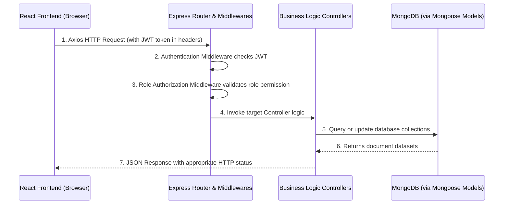

# Multi-Salon Management Web Application: File Structure Document

This document provides a comprehensive overview of the workspace structure, design patterns, and directory hierarchy for both the **Backend** and the **Frontend** of the Multi-Salon Management Web Application.

---

## 📂 Overall Project Directory Structure

At the root level, the project is structured as a monorepo-style repository containing two distinct sub-projects: the Express-based backend API server and the React-based single page frontend application.

```text
multi-salon-web-app/
├── backend/                  # Node.js/Express REST API Server
└── frontend/                 # React Single Page Application (SPA)
```

---

## 🖥️ Backend Architecture & File Structure (`backend/`)

The backend is built as a **Node.js** application using **Express.js** and **Mongoose (MongoDB)**. It follows the **MVC (Model-View-Controller)** pattern (with the React Frontend acting as the View) and uses **ES Modules** (`"type": "module"`).

### Backend Directory Tree
```text
backend/
├── config/
│   └── db.js                 # MongoDB connection logic using Mongoose
├── controllers/              # Business logic controllers
│   ├── appointmentController.js
│   ├── authController.js
│   ├── billController.js
│   ├── revenueController.js
│   ├── salonController.js
│   ├── serviceController.js
│   └── staffController.js
├── middleware/               # Express request interceptor middlewares
│   ├── authMiddleware.js     # JWT token validation & decryption
│   └── roleMiddleware.js     # Role authorization (e.g., admin, customer)
├── models/                   # Mongoose schemas & MongoDB interfaces
│   ├── Admin.js
│   ├── Appointment.js
│   ├── AppointmentService.js
│   ├── Attendance.js
│   ├── Bill.js
│   ├── Customer.js
│   ├── Review.js
│   ├── Salary.js
│   ├── Salon.js
│   ├── Service.js
│   ├── ServiceCategory.js
│   ├── Staff.js
│   └── StaffAvailability.js
├── routes/                   # REST API route endpoints mapping to controllers
│   ├── appointmentRoutes.js
│   ├── authRoutes.js
│   ├── billRoutes.js
│   ├── customerRoutes.js
│   ├── revenueRoutes.js
│   ├── reviewRoutes.js
│   ├── salonRoutes.js
│   ├── serviceRoutes.js
│   └── staffRoutes.js
├── uploads/                  # Temporary file upload directory (used by Multer)
├── utils/                    # Shared utility files
│   └── generateToken.js      # JWT Token generation utility
├── .env                      # Environment configuration variables
├── server.js                 # Express Application entry point
├── package.json              # Dependency & scripts manifest file
└── package-lock.json         # Pinned dependency log
```

### Key Modules and Folders Explained

1. **`server.js`**
   - The central entry point of the backend application.
   - Initializes Express, loads environment variables using `dotenv`, connects to MongoDB via `config/db.js`, and sets up global middleware like `cors()` and `express.json()`.
   - Mounts the versioned API routes under prefix paths (e.g., `/api/auth`, `/api/salons`).

2. **`config/`**
   - Contains database connection setups.
   - `db.js`: Establishes and logs the connection status to the MongoDB instance using Mongoose.

3. **`controllers/`**
   - Handles the incoming HTTP request payload, interacts with Mongoose models, applies business logic, and sends back appropriate HTTP status codes and JSON responses.
   - Separate controllers exist for salon branches, user authentication, booking appointments, services, staff, billing, and financial analytics.

4. **`models/`**
   - Definitions of Mongoose schemas that map to collections in MongoDB.
   - Key models include:
     - `Customer`, `Admin`, `Staff`: User profiles and organizational roles.
     - `Salon`: Store details (location, capacity, open/close time, revenue, staff count).
     - `Appointment`: Scheduled times, service associations, staff assignments, status, and prices.
     - `Bill`, `Revenue`, `Salary`: Auditing and billing datasets.

5. **`routes/`**
   - Maps specific URL endpoints and HTTP verbs (GET, POST, PUT, DELETE) to their corresponding controller actions.
   - Integrates authentication and role authorization middlewares to guard private endpoints.

6. **`middleware/`**
   - Interceptors that execute prior to executing controller logic.
   - `authMiddleware.js`: Verifies `Bearer` JWT headers inside incoming requests to confirm the sender's identity.
   - `roleMiddleware.js`: Inspects decrypted user payloads to restrict routes based on administrative privileges (e.g., `super-admin`, `admin`, `customer`).

7. **`utils/`**
   - Non-business logic utilities. For example, `generateToken.js` signs user JSON Web Tokens with a secret key and sets their expiration period.

---

## 🎨 Frontend Architecture & File Structure (`frontend/`)

The frontend is a **React** application bootstraped using `react-scripts`. It utilizes **React Router** (v7) for client-side routing, **Axios** for API requests, and **React Context API** for global state management.

### Frontend Directory Tree
```text
frontend/
├── public/                   # Static public assets (HTML entry point, icons)
│   ├── favicon.ico
│   └── index.html            # Main HTML document template
├── src/                      # Source code
│   ├── assets/               # Local static images, SVGs, and visual files
│   ├── components/           # Reusable UI components
│   │   ├── booking/          # Appointment selection components (e.g., BookingForm, TimeSlot)
│   │   ├── common/           # Generic base widgets (Button, Input, Loader, Modal)
│   │   └── layout/           # Dashboard shell containers, Navigation, and Sidebar
│   ├── constants/            # Global constants and config lookups (e.g., roles.js)
│   ├── context/              # Context Providers for global React state
│   │   └── AuthContext.jsx   # Authentication context and login state provider
│   ├── hooks/                # Custom React hooks
│   │   └── useAuth.js        # Helper to easily query AuthContext values
│   ├── pages/                # Page route views
│   │   ├── admin/            # Salon-level management (Availability, Bookings, Services)
│   │   ├── auth/             # Login, Register, Profile Edit pages
│   │   ├── customer/         # Booking interfaces (SelectBranch, SelectService, Time)
│   │   ├── superadmin/       # System-wide oversight (AddSalon, Revenue, ManageAdmins)
│   │   ├── Unauthorized.jsx  # Access denied page for role mismatch
│   │   └── NotFound.jsx      # Fallback 404 page
│   ├── routes/               # Route definitions and access controllers
│   │   ├── AppRoutes.jsx
│   │   ├── ProtectedRoute.jsx
│   │   └── RoleBasedRoute.jsx
│   ├── services/             # Backend API communications layer (Axios wrappers)
│   │   ├── api.js            # Base Axios instance with base URL and auth headers
│   │   ├── authService.js
│   │   ├── bookingService.js
│   │   ├── revenueService.js
│   │   ├── salonService.js
│   │   └── staffService.js
│   ├── utils/                # Date operations and time-slot generator utilities
│   │   ├── formatDate.js
│   │   └── slotGenerator.js
│   ├── App.css               # Core app stylesheet (with UI styling rules)
│   ├── App.jsx               # Application routing definition and providers setup
│   ├── index.css             # Base CSS styles & typography
│   ├── index.js              # React engine entry point (React DOM initialization)
│   └── main.jsx              # Alternative setup entrypoint
├── .env                      # Frontend environment setup (e.g. REACT_APP_API_URL)
└── package.json              # Client dependencies config
```

### Key Modules and Folders Explained

1. **`src/App.jsx`**
   - The central React entry component.
   - Configures the client router (`BrowserRouter`) and wraps the entire DOM inside the global `<AuthProvider>`.
   - Defines routes, separating public pages from authentication-guarded dashboards utilizing `<ProtectedRoute>`.

2. **`src/components/`**
   - Houses UI fragments partitioned by scope:
     - `common/`: Core atomic UI components (buttons, input boxes, spinners, dialog overlay boxes) to ensure consistency.
     - `layout/`: Global layout templates (header navigation bar, sidebar panels, footer details).
     - `booking/`: Multi-step wizard blocks (cards showing services, booking timetables, select calendar grids).

3. **`src/pages/`**
   - Folder structure mimics roles for clean separations:
     - `superadmin/`: Panels for creating new salons, system analytics, global revenue dashboards.
     - `admin/`: Branch-level settings such as service categories, staff assignments, and availability calendars.
     - `customer/`: Simplified booking steps allowing clients to choose a location, service, technician, and timeslot.
     - `auth/`: Custom entry screens to authenticate, register, and update personal account details.

4. **`src/services/`**
   - Modularized backend integration scripts utilizing **Axios**.
   - `api.js` configures the baseline URL pointing to the Backend API and attaches interceptors to load JWT storage tokens from client cookies/localStorage automatically.

5. **`src/context/` & `src/hooks/`**
   - Handles application state.
   - `AuthContext.jsx` maintains authentication records, logs in users, cleans sessions on logout, and shares this state with all React child components.
   - `useAuth.js` provides shorthand access to variables like `user`, `login()`, and `logout()`.

---

## ⚡ Integration and Workflow Flow


